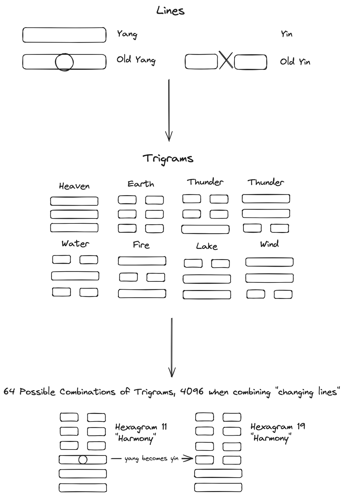

# I-Ching Explorer

- Use `npm run dev` to start the dev server
- Use `npm run test` to run Jest tests

## Using the App & General Explanation

The app is an interactive tool based on the [I-Ching](https://en.wikipedia.org/wiki/I_Ching), an ancient Chinese divination tool.

The I-Ching functions by the generation of yin/yang lines. These lines are arranged in groups of 3 called "Trigrams". A changing or "old" line will transform into its opposite.

Two Trigrams combine to form a hexagram, creating 64 possible combinations.

The App has two modes, when clicking on the 6 lines:
1. Reading: lines are randomly generated.
2. Explore: lines will cycle between:
   1. None
   2. Yin
   3. Old yin
   4. Yang
   5. Old Yang

Once a hexagram is formed, a reading section will appear. This contains a collection of 8 translations offering descriptions behind the meaning of the lines.

Each location within the 6 places has a "correct" energy (yin or yang) as well as a "correlate":
Line 1 Yang and Line 4 Yin
Line 2 Yin and Line 5 Yang
Line 3 Yang and Line 6 Yin

When a line is in an incorrect energy, it will have a ❌ symbol appended. When in a correct energy it will have a ✅, and if it is both in the correct energy and correlation it will have a ⭐️. 

There is a "Journal" button which when clicked, a Title and Description can be added to give context to the reading, when saved a history of readings can be viewed from the Journal Page.

The "Options" menu can be accessed when in "Explore" mode, all 64 hexagrams can be cycled through, as well as automatically computing the changing lines necessary to move from one Hexagram to any other.